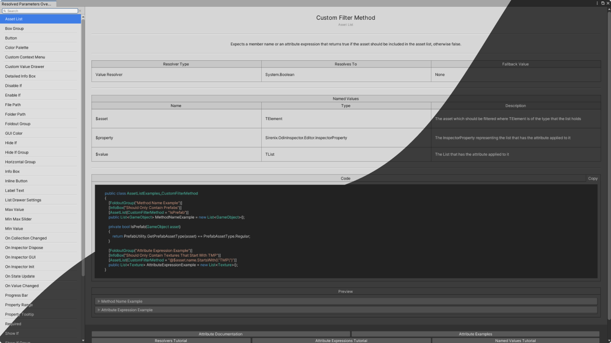

An editor window listing all Odin attribute parameters using value/action resolvers. It shows:

- Name
- Owning Attribute
- Description
- Additional Infos/Warnings
- Resolver Type
- Resolves To
- Fallback Value
- Named Value Information
    - Name
    - Type
    - Description
- Example Code
- Example Preview

### Installation
Simply put the downloaded ResolvedParametersOverviewWindow folder in your project and  
open the window by navigating to `Tools > Odin Inspector > Resolved Parameters Overview`.

> Requires at least Unity 2019.4.0  
> Requires at least Odin 3.0.12.0
